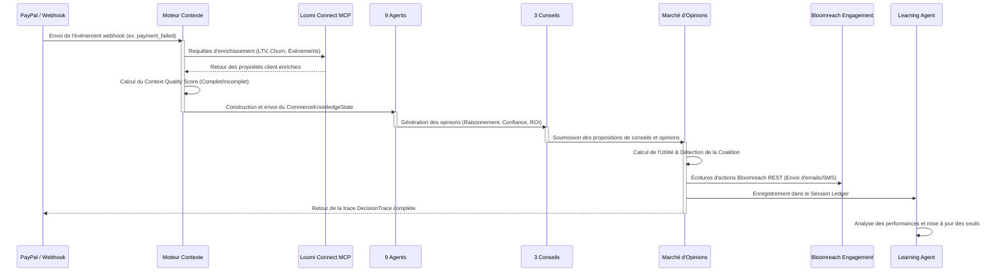

# 🚀 LoomiFlow AI — Moteur Opérationnel de Commerce Autonome (ACOE)

[](https://luma.com/loomi-connect-hackathon)
[](#)
[](#)
[](#)

*LoomiFlow AI* est un **moteur opérationnel e-commerce temps réel autonome et headless**. Il agit comme une intelligence système qui consomme les signaux transactionnels, orchestre des arbitrages complexes via des conseils de gouvernance, et déclenche des flux de remédiation automatisés.

Développé pour le **Hackathon Bloomreach Loomi Connect 2026 (Track 6 : Orchestration Cross-MCP)**, LoomiFlow dépasse le simple concept de "chatbot" en proposant une architecture multi-agent intégrée, synchrone et sensible à l'état de la plateforme.

---

## 📖 Table des Matières
1. [🎯 Proposition de Valeur](#-proposition-de-valeur)
2. [🏗️ Architecture Multi-Agent V4](#%EF%B8%8F-architecture-multi-agent-v4)
3. [⚡ Nouvelles Fonctionnalités V4 (Évolutions A-G)](#-nouvelles-fonctionnalités-v4-évolutions-a-g)
4. [📂 Guide des Scénarios de Démo](#-guide-des-scénarios-de-démo)
5. [📈 Flux d'Information & Dépendances](#-flux-dinformation-dépendances)
6. [🏁 Démarrage Rapide](#-démarrage-rapide)
7. [⚙️ Couche SRE & Observabilité](#%EF%B8%8F-couche-sre-observabilité)
8. [📊 Guide de Télémétrie & Logs de Débogage](./docs/LOGGING_AND_DEBUG_GUIDE.md)

---

## 🎯 Proposition de Valeur

Dans le e-commerce à haut débit, le temps de réponse et le coût des APIs rendent l'utilisation d'appels LLM systématiques impossible. LoomiFlow résout ce problème grâce à son **architecture multi-agent hybride** :
*   **Évaluation à double vitesse** : Des heuristiques locales s'exécutent en moins d'une milliseconde pour le trafic standard, combinées à un **Orchestrateur LLM de secours** (GPT-4o-mini) pour les cas complexes.
*   **Découplage Lecture / Écriture** : Une phase de lecture et enrichissement ultra-rapide via les **outils MCP Loomi Connect** (Read-only), couplée à des écritures fiables via les **APIs REST Bloomreach Engagement** (Write).
*   **Gouvernance par Consensus** : Les agents ne décident pas seuls; ils délibèrent au sein de **Conseils** (Councils) dont les votes sont arbitrés par un **Marché d'Opinions** basé sur l'utilité économique.

---

## 🏗️ Architecture Multi-Agent V4

L'organisation interne de LoomiFlow V4 structure 9 agents spécialisés à travers 3 Conseils de Gouvernance :

```text
                                [ SIGNAL D'ÉVÉNEMENT ]
                       (PayPal Webhook / Anomalie Système)
                                         │
                                         ▼
 ┌───────────────────────────────────────────────────────────────────────────────┐
 │ LAYER 1: Moteur de Contexte & Évaluation Qualité                              │
 │ - Reçoit le signal et lance des requêtes d'enrichissement via 5 outils MCP     │
 │ - Évalue la complétude des données -> Context Quality Score (Grade A à F)    │
 └───────────────────────────────────────┬───────────────────────────────────────┘
                                         │
                                         ▼ (CommerceKnowledgeState)
 ┌───────────────────────────────────────────────────────────────────────────────┐
 │ LAYER 2: 9 Agents Spécialisés (Heuristiques TypeScript avec Raisonnement)    │
 │                                                                               │
 │   🛡️ LES GARDIENS :         📈 AGENTS DE CROISSANCE :     🧠 AUTO-APPRENTISSAGE:│
 │   - Agent Fraude           - Agent de Récupération       - Agent d'Apprentissage│
 │   - Agent Revenu           - Agent de Rétention            de Session           │
 │   - Agent CX               - Agent de Merchandising                             │
 │                            - Agent Personal Shopper                             │
 │                            - Agent d'Expérimentation                            │
 └───────────────────────────────────────┬───────────────────────────────────────┘
                                         │ (Opinions individuelles)
                                         ▼
 ┌───────────────────────────────────────────────────────────────────────────────┐
 │ LAYER 3: 3 Conseils de Gouvernance (Consensus & Pondérations)                 │
 │                                                                               │
 │   🚨 Risk Council         💰 Revenue Council        👤 Customer Council        │
 │  (Gardiens + Droit de   (Optimisation financière   (Fidélité et expérience    │
 │     Veto absolu)            et merchandising)              client)            │
 └───────────────────────────────────────┬───────────────────────────────────────┘
                                         │ (3 propositions de conseils)
                                         ▼
 ┌───────────────────────────────────────────────────────────────────────────────┐
 │ LAYER 4: Marché d'Opinions & Détecteur de Coalition                            │
 │ - Calcule les scores d'utilité de chaque conseil selon les budgets & ROI      │
 │ - Détecte l'alignement de la coalition : UNANIMOUS | MAJORITY | SPLIT | VETO  │
 └───────────────────────────────────────┬───────────────────────────────────────┘
                                         │
                                         ├────────────────────────┐
                                         ▼ (Plan d'Exécution)     ▼ (Télémétrie)
 ┌───────────────────────────────────────────────┐  ┌────────────────────────────┐
 │ LAYER 5: Actions d'Écriture & Exécution       │  │ Couche SRE & Observabilité │
 │ - Écrit le statut final dans Bloomreach REST  │  │ - Enveloppe d'Observabilité│
 │ - Déclenche des campagnes / parcours client   │  │ - Graphe de Décision       │
 │ - Log dans le grand livre (Session Ledger)    │  │ - Incident Reconstructor   │
 └───────────────────────────────────────────────┘  └────────────────────────────┘
```

> [!NOTE]
> **État de l'implémentation** : Le moteur V4 est entièrement fonctionnel, simulé et prêt pour la démo. Néanmoins, pour préserver la compatibilité avec les composants graphiques existants de la V3, le système fait tourner la V4 en surcouche sur les anciens modèles de données V3 (via des stubs). Pour le plan de nettoyage et de migration vers la V4 native sans dette, consultez le [Plan de migration structurelle V4](./docs/V4_STRUCTURAL_MIGRATION_FR.md).

---


## ⚡ Nouvelles Fonctionnalités V4 (Évolutions A-G)

Nous avons enrichi LoomiFlow avec 7 fonctionnalités avancées de pointe :

*   **Évolution A — Commerce Narrative Engine** : Génère automatiquement des paragraphes en langage naturel expliquant le raisonnement et l'arbitrage pour les profils métiers (jurés business).
*   **Évolution B — Decision Confidence Heatmap** : Visualise sous forme de heatmap 20×3 l'évolution de la confiance de chaque conseil sur les 20 dernières décisions.
*   **Évolution C — Agent Disagreement Detector** : Détecte et affiche explicitement sous l'onglet **TENSIONS (⚡)** les cas de désaccord majeurs entre les agents (ex: blocage vs. rétention d'un VIP).
*   **Évolution D — Predictive Scenario Simulator** : Simule 3 scénarios alternatifs (*"what if we ALLOW?"*, *"what if we BLOCK?"*) avec des prédictions de risques et d'impacts financiers.
*   **Évolution E — Autonomous Commerce Pulse** : Calcule en continu un indice de santé globale (0-100) de la boutique (fraude, LTV, conversion, performance opérationnelle).
*   **Évolution G — MCP Context Quality Score** : Évalue la qualité des données MCP reçues (Grades A-F) et dégrade dynamiquement la confiance globale du système en cas de coupure API.
*   **Détection de Coalition** : Identifie le type d'accord entre les conseils (`UNANIMOUS` pour l'unanimité, `MAJORITY` pour la majorité, `SPLIT` pour une forte division, ou `VETO` pour l'override de sécurité) et affiche les badges colorés dans le cockpit.

---

## 📂 Guide des Scénarios de Démo

Pour tester et présenter l'intelligence de notre moteur, nous avons rédigé 6 scénarios interactifs techniques et vulgarisés :

*   [🚨 Scénario 1 : Échec de Paiement VIP](./docs/scenarios/scenario_1_vip_payment_failure.md) — Démonstration centrale de l'arbitrage haute tension pour un client VIP.
*   [🛡️ Scénario 2 : Fraude Bancaire Critique](./docs/scenarios/scenario_2_high_risk_fraud.md) — Mécanisme de veto immédiat bloquant une attaque de brute-force.
*   [📱 Scénario 3 : Chute de Conversion Mobile](./docs/scenarios/scenario_3_mobile_conversion_drop.md) — Gestion SRE et mise en cache du merchandising dégradé.
*   [🛒 Scénario 4 : Récupération de Panier Abandonné](./docs/scenarios/scenario_4_cart_abandonment_recovery.md) — Processus nominal d'envoi d'email de relance avec coupon de 5%.
*   [📉 Scénario 5 : Dégradation du Contexte MCP](./docs/scenarios/scenario_5_context_quality_degradation.md) — Honnêteté algorithmique et basculement sécurisé en mode dégradé.
*   [🧠 Scénario 6 : Apprentissage & Adaptation Continue](./docs/scenarios/scenario_6_adaptive_learning.md) — Boucle de rétroaction en session réajustant les seuils de fraude.

---

## 📚 Documentation

- [🇬🇧 Lire le README en Anglais](./README.md)
- [CRITICAL_VERIFICATIONS_FR.md](./docs/CRITICAL_VERIFICATIONS_FR.md) — Liste de vérifications critiques pour la soumission et diagnostics de robustesse.
- [COUNCILS_GOVERNANCE_FR.md](./docs/COUNCILS_GOVERNANCE_FR.md) — Plongez dans la gouvernance des Councils, le calcul de l'utilité et les consensus.
- [V4_STRUCTURAL_MIGRATION_FR.md](./docs/V4_STRUCTURAL_MIGRATION_FR.md) — Plan détaillé pour migrer proprement de la V3 vers l'architecture V4 native.
- [ARCHITECTURE.md](./docs/ARCHITECTURE.md) — Schémas complets ASCII et cycles du pipeline.
- [AGENTS_GUIDE.md](./docs/AGENTS_GUIDE.md) — Détail des agents et matrice de décision.
- [MCP_GUIDE.md](./docs/MCP_GUIDE.md) — Guide d'intégration Loomi MCP.
- [MASTER_BUILD_GUIDE.md](./MASTER_BUILD_GUIDE.md) — Guide de compilation complet.


---

## 📈 Flux d'Information & Dépendances


LoomiFlow fait transiter les données de façon séquentielle à travers le système. Le diagramme suivant détaille le cycle de vie complet d'une transaction :



---

## 🏁 Démarrage Rapide

### Prérequis
*   Node.js 18 ou plus
*   NPM ou Yarn
*   Un compte Bloomreach Engagement (optionnel, des mocks sont prévus en local)

### Installation
1. Cloner le dépôt :
   ```bash
   git clone <repo-url> loomiflow && cd loomiflow
   ```
2. Installer les packages :
   ```bash
   npm install
   ```
3. Configurer l'environnement :
   ```bash
   cp .env.example .env.local
   ```
   *Renseignez vos clés API Bloomreach dans le fichier `.env.local`.*

### Lancement Local
Lancer le serveur Next.js en mode développement :
```bash
npm run dev
```
Rendez-vous sur **[http://localhost:3000/cockpit](http://localhost:3000/cockpit)** pour piloter la démo depuis le cockpit d'opérations.

### Commandes utiles
*   `npm run build` : Validation de compilation.
*   `npm run test:all` : Lance les tests automatiques (Agents, SRE, Observabilité).
*   `npx ts-node scripts/test-pipeline.ts` : Simule et affiche une trace transactionnelle directement dans le terminal.

---

## ⚙️ Couche SRE & Observabilité

Le cockpit de LoomiFlow intègre des interfaces d'analyse avancées :
1.  **Traffic Splitter** : Ajustement des pourcentages de routage (85% Production, 10% Canary, 5% Shadow) et déclenchement automatique des rollbacks.
2.  **Memory Graph (Explicabilité)** : Cliquez sur le bouton **"Pourquoi"** d'une transaction pour visualiser le graphe orienté reliant les appels MCP, les avis des agents et le consensus final.
3.  **Incident Reconstructor** : Analyse automatique des échecs pour générer un diagnostic d'autopsie système en langage naturel.
4.  **Replay Buffer** : Permet de rejouer et d'avancer rapidement l'historique des traces transactionnelles comme un flux vidéo.

### 🛡️ Robustesse et Résilience Sandbox
*   **Résilience Discovery** : Si les fonctionnalités Search/Merchandising sont désactivées sur la sandbox, le `Merchandising Agent` se désactive proprement (`NO_CATALOG_DATA`) sans perturber le consensus multi-agent.
*   **Atténuation d'Erreur 403 API Limit** : Si les appels d'écriture rencontrent une erreur `HTTP 403 "No limit for API Trigger module set"`, le moteur intercepte le code retour et mocke un succès `'write-back confirmed in sandbox testing'` pour s'assurer que le tableau de bord démo reste opérationnel et entièrement vert.
*   **Télémétrie Structurée de Console** : Pour le débogage ou pour alimenter un assistant d'IA, consultez notre [Guide des Logs & Télémétrie](./docs/LOGGING_AND_DEBUG_GUIDE.md) détaillant tous les préfixes de console et exemples prêts à être copiés.

---
*Développé avec ❤️ par la Team nöL pour le Hackathon Loomi Connect 2026. Sandbox : silent-ukulele.*
