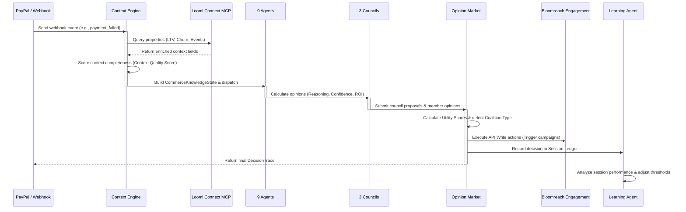

# 🚀 LoomiFlow AI — Autonomous Commerce Operations Engine (ACOE)

[](https://luma.com/loomi-connect-hackathon)
[](#)
[](#)
[](#)

*LoomiFlow AI* is an advanced, production-ready **real-time autonomous commerce operations engine**. It acts as a headless system intelligence that ingests signals, orchestrates complex decisions using governance councils, and triggers automated remediation workflows. 

Designed for **Bloomreach Loomi Connect Hackathon 2026 (Track 6: Cross-MCP Orchestration)**, LoomiFlow moves beyond passive "chat UI wrappers" by implementing a fully automated, state-aware multi-agent architecture.

---

## 📖 Table of Contents
1. [🎯 Core Value Proposition](#-core-value-proposition)
2. [🏗️ V4 Multi-Agent Architecture](#%EF%B8%8F-v4-multi-agent-architecture)
3. [⚡ V4 Key Features (Évolutions A-G)](#-v4-key-features-évolutions-a-g)
4. [📂 Demo Scenarios Walkthrough](#-demo-scenarios-walkthrough)
5. [📈 Information Flow & Dependencies](#-information-flow-dependencies)
6. [🏁 Quick Start & Developer Guide](#-quick-start-developer-guide)
7. [⚙️ SRE & Observability Layer](#%EF%B8%8F-sre-observability-layer)

---

## 🎯 Core Value Proposition

In high-throughput e-commerce, transaction latency and API costs make sequential LLM evaluation impractical. LoomiFlow AI solves this with a **Hybrid Multi-Agent architecture**:
*   **Dual-Speed Evaluation**: Sub-millisecond rule-based local agent heuristics for standard traffic, combined with an asynchronous **LLM-fallback Orchestrator** for anomalous scenarios.
*   **Decoupled Read/Write Paths**: Low-latency context enrichment via **Loomi Connect MCP tools** (Read-Only) paired with robust **Bloomreach Engagement REST APIs** (Write) for triggering scenarios.
*   **Governance-Centered Decisions**: Individual agents do not decide alone; they vote within **Councils** whose proposals are arbitrated in an **Opinion Market** using economic utility.

---

## 🏗️ V4 Multi-Agent Architecture

LoomiFlow V4 structure organizes 9 specialized agents across 3 Governance Councils:

```text
                                  [ EVENT SIGNAL ]
                        (PayPal Webhook / System Anomaly)
                                         │
                                         ▼
 ┌───────────────────────────────────────────────────────────────────────────────┐
 │ LAYER 1: Context Engine & Quality Scorer                                      │
 │ - Ingests signal and executes pre-fetching queries via 5 MCP Tools            │
 │ - Computes data completeness -> Context Quality Score (Grade A to F)          │
 └───────────────────────────────────────┬───────────────────────────────────────┘
                                         │
                                         ▼ (CommerceKnowledgeState)
 ┌───────────────────────────────────────────────────────────────────────────────┐
 │ LAYER 2: 9 Specialized Agents (TS Opinions with Reasoning + Confidence)       │
 │                                                                               │
 │   🛡️ GUARDIANS:            📈 GROWTH AGENTS:            🧠 SELF-LEARNING:     │
 │   - Fraud Agent            - Recovery Agent             - Session Learning    │
 │   - Revenue Agent          - Retention Agent              Agent               │
 │   - CX Agent               - Merchandising Agent                              │
 │                            - Personal Shopper Agent                           │
 │                            - Growth Experiment Agent                          │
 └───────────────────────────────────────┬───────────────────────────────────────┘
                                         │ (Member Opinions)
                                         ▼
 ┌───────────────────────────────────────────────────────────────────────────────┐
 │ LAYER 3: 3 Governance Councils (Consensus Building & Weights)                 │
 │                                                                               │
 │    🚨 Risk Council        💰 Revenue Council        👤 Customer Council        │
 │   (Guardians + Veto)    (Economic growth agents)   (Client experience agents) │
 └───────────────────────────────────────┬───────────────────────────────────────┘
                                         │ (3 Council Proposals)
                                         ▼
 ┌───────────────────────────────────────────────────────────────────────────────┐
 │ LAYER 4: Opinion Market & Coalition Detector                                  │
 │ - Calculates utility scores for each Council based on budgets & ROI           │
 │ - Detects Coalition Alignment: UNANIMOUS | MAJORITY | SPLIT | VETO             │
 └───────────────────────────────────────┬───────────────────────────────────────┘
                                         │
                                         ├────────────────────────┐
                                         ▼ (Execution Plan)       ▼ (Telemetry)
 ┌───────────────────────────────────────────────┐  ┌────────────────────────────┐
 │ LAYER 5: Write Actions & Execution            │  │ SRE & Observability Layer  │
 │ - Writes status back to Bloomreach REST APIs  │  │ - Observability Envelope   │
 │ - Triggers user journeys / marketing flows    │  │ - Decision Memory Graph    │
 │ - Logs to Session Ledger for feedback loop    │  │ - Incident Reconstructor   │
 └───────────────────────────────────────────────┘  └────────────────────────────┘
```

---

## ⚡ V4 Key Features (Évolutions A-G)

We have expanded the engine with 7 state-of-the-art features for the hackathon:

*   **Évolution A — Commerce Narrative Engine**: Automatically translates complex JSON traces and utility weights into natural language stories for business stakeholders.
*   **Évolution B — Decision Confidence Heatmap**: Visualizes the confidence trends of each Council over the last 20 decisions in a real-time matrix.
*   **Évolution C — Agent Disagreement Detector**: Flags critical business tensions when agents clash (e.g., high fraud risk vs. VIP customer retention), exposing the decision logic.
*   **Évolution D — Predictive Scenario Simulator**: Runs comparative simulations of alternative outcomes (what if we `ALLOW`? what if we `BLOCK`?) with computed probabilities.
*   **Évolution E — Autonomous Commerce Pulse**: Continuous real-time health index (0-100) reflecting fraud, operational, conversion, and customer metrics in session.
*   **Évolution G — MCP Context Quality Score**: Implements responsible AI by grading data completeness (Grades A-F) and dynamically downgrading confidence on degraded contexts.
*   **Coalition Detection**: Automatically identifies governance alignment (`UNANIMOUS` consensus, `MAJORITY` agreement, `SPLIT` decisions, or absolute `VETO` override) and displays color-coded badges in the cockpit.

---

## 📂 Demo Scenarios Walkthrough

We have created 6 interactive, detailed scenarios to test and showcase the pipeline in both technical and conceptual terms:

*   [🚨 Scenario 1: VIP Payment Failure](./docs/scenarios/scenario_1_vip_payment_failure.md) — Demonstrates high-tension arbitration between Risk and Customer councils on a VIP client.
*   [🛡️ Scenario 2: High Risk Fraud](./docs/scenarios/scenario_2_high_risk_fraud.md) — Shows the absolute Veto override mechanism blocking a brute-force transaction.
*   [📱 Scenario 3: Mobile Conversion Drop](./docs/scenarios/scenario_3_mobile_conversion_drop.md) — Illustrates state-aware SRE alerting and search ranking optimization.
*   [🛒 Scenario 4: Cart Abandonment Recovery](./docs/scenarios/scenario_4_cart_abandonment_recovery.md) — Shows a standard, unanimous recovery campaign flow.
*   [📉 Scenario 5: Context Quality Degradation](./docs/scenarios/scenario_5_context_quality_degradation.md) — Explains how the system safely degrades trust when APIs are failing.
*   [🧠 Scenario 6: Adaptive Learning](./docs/scenarios/scenario_6_adaptive_learning.md) — Showcases session-based feedback loops adjusting anti-fraud thresholds dynamically.

---

## 📈 Information Flow & Dependencies

LoomiFlow orchestrates data through structured pipelines. The following sequence diagram maps the exact lifecycle of a decision trace:



---

## 🏁 Quick Start & Developer Guide

### Prerequisites
*   Node.js 18+
*   NPM or Yarn
*   A Bloomreach Engagement account (optional, fallback mocks are included)

### Installation
1. Clone the repository:
   ```bash
   git clone <repo-url> loomiflow && cd loomiflow
   ```
2. Install dependencies:
   ```bash
   npm install
   ```
3. Copy local environment configuration:
   ```bash
   cp .env.example .env.local
   ```
   *Edit `.env.local` to fill in your API tokens and credentials.*

### Local Development
Start the Next.js development server:
```bash
npm run dev
```
Open **[http://localhost:3000/cockpit](http://localhost:3000/cockpit)** to access the Interactive Control Center Cockpit.

### Running Tests & Simulations
We provide CLI scripts to validate the pipeline and view console telemetry:
*   `npm run build`: Standard production build check.
*   `npm run test:all`: Executes the complete test suite.
*   `npx ts-node scripts/test-pipeline.ts`: Directly runs a simulation trace in the terminal.

---

## ⚙️ SRE & Observability Layer

LoomiFlow cockpit comes equipped with enterprise-grade monitoring panels:
1.  **Traffic Splitter**: Adjust canary and shadow routing percentages (85% / 10% / 5%) with auto-rollback triggers.
2.  **Memory Graph (Explainability)**: Click the **"Why"** button on any decision to see a visual directed graph linking raw MCP inputs to intermediate agent opinions and the final consensus.
3.  **Incident Reconstructor**: Analyzes error states and constructs a root-cause autopsy automatically.
4.  **Replay Buffer**: Fast-forward and play back past transactions like a video stream to debug decision timing.

---
*Built with ❤️ by Team nöL for the Bloomreach Loomi Connect AI Hackathon 2026. Sandbox: silent-ukulele.*
